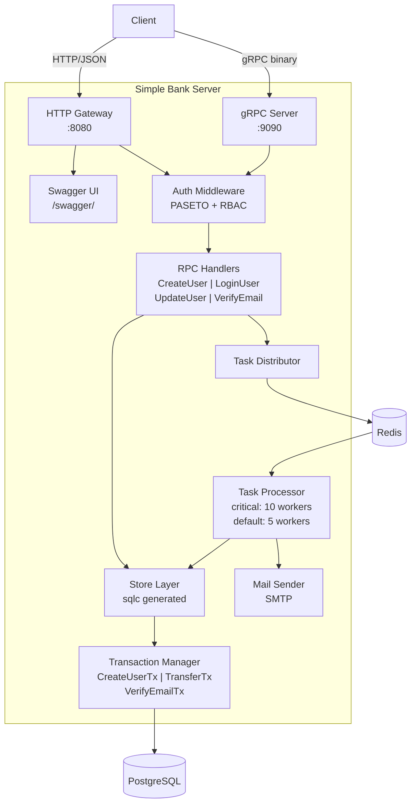
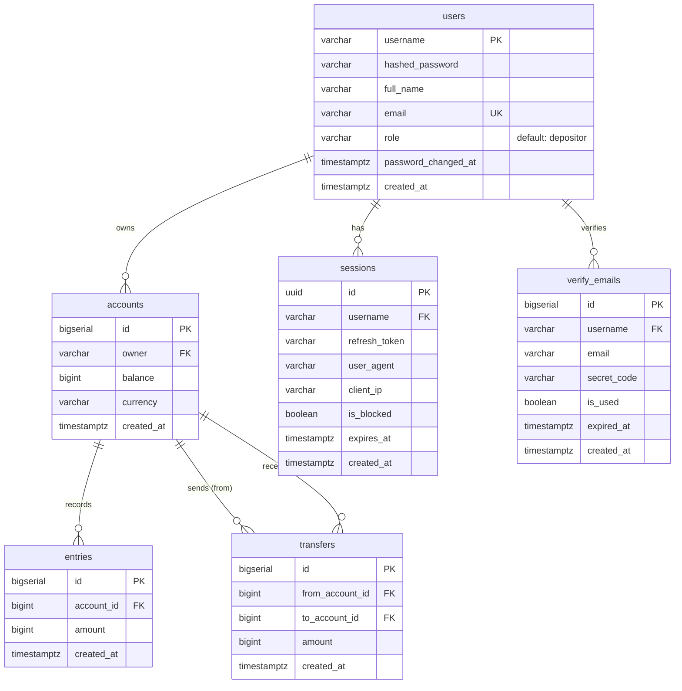

# Simple Bank - Go Backend

A production-grade banking backend API built with Go, demonstrating gRPC + HTTP dual-protocol serving, async task processing, RBAC, and database transaction patterns.

## What It Does

Simple Bank is a backend service that handles core banking operations:

- **Account Management** - Create and manage bank accounts with multi-currency support (USD, EUR, CAD)
- **Money Transfers** - Transfer funds between accounts with PostgreSQL transaction isolation (deadlock-free)
- **User Authentication** - Login with PASETO token-based auth (access token + refresh token + session tracking)
- **Email Verification** - Async email verification workflow via Redis task queue with retry logic
- **Role-Based Access Control** - `depositor` and `banker` roles with per-endpoint authorization
- **Dual Protocol API** - Single service serves both gRPC (binary) and HTTP/JSON via gRPC-Gateway
- **Swagger Documentation** - Auto-generated OpenAPI docs served at `/swagger/`

## Tech Stack

| Category | Technology |
|---|---|
| Language | Go 1.23 |
| API | gRPC + gRPC-Gateway (HTTP/JSON) |
| Database | PostgreSQL 16 |
| SQL Codegen | sqlc (type-safe, compile-time verified) |
| Migration | golang-migrate |
| Auth | PASETO v2 (symmetric key encryption) |
| Async Worker | Redis 7 + Asynq |
| Logging | zerolog (structured JSON logging) |
| Docs | Swagger / OpenAPI v2 (protoc-gen-openapiv2) |
| Testing | Go testing + mockgen |
| Infra | Docker, Docker Compose, Kubernetes (EKS) |

## Why I Built It

This project was built to demonstrate hands-on experience with production backend patterns:

- **gRPC + HTTP dual serving** - A single service handling both protocols, which is common in microservice architectures
- **Async task processing** - Redis-backed job queue with priority queues, retry logic, and graceful shutdown
- **Database transaction patterns** - PostgreSQL transactions with proper isolation, deadlock prevention, and callback-based composition
- **Token-based auth** - PASETO tokens with access/refresh token rotation and server-side session tracking
- **Type-safe SQL** - sqlc code generation eliminates runtime SQL errors and provides compile-time safety
- **Graceful shutdown** - Signal handling with errgroup for clean concurrent goroutine management

## Architecture



### Request Flow

```
1. Client sends HTTP/JSON or gRPC request
2. Auth middleware extracts Bearer token from metadata/header
3. PASETO token verified → username, role extracted
4. RBAC check against endpoint's allowed roles
5. Handler executes business logic via Store (sqlc)
6. Database transactions run with callback pattern
7. Async tasks (email) queued to Redis via Distributor
8. Worker processes tasks with retry + priority queues
```

## Key Technical Challenges

### 1. Dual Protocol Serving (gRPC + HTTP)
A single service definition in Protocol Buffers serves both gRPC and HTTP/JSON simultaneously. The HTTP gateway translates JSON requests into gRPC calls, sharing all handler logic without duplication.

### 2. Transaction Composition with Callbacks
Database transactions use a callback pattern that allows composing multiple operations atomically. For example, `CreateUserTx` creates a user record AND queues an email verification task within the same transaction boundary.

### 3. Async Email Verification Pipeline
User registration triggers an async task via Redis/Asynq. The worker generates a secret code, stores it with a 15-minute TTL, and sends a verification email. Priority queues (`critical` with 10 workers, `default` with 5) ensure task throughput.

### 4. Deadlock-Free Money Transfers
The `TransferTx` implementation orders account locks by ID to prevent deadlocks when concurrent transfers occur between the same pair of accounts.

### 5. Graceful Shutdown Orchestration
Uses Go's `errgroup` to manage three concurrent services (gRPC server, HTTP gateway, task processor). On SIGTERM/SIGINT, each component shuts down cleanly - gRPC finishes in-flight RPCs, HTTP drains connections, and the worker completes running tasks.

### 6. RBAC at the Handler Level
Authorization is enforced per-RPC with role lists. For example, `UpdateUser` allows both the `banker` role (can update any user) and the user themselves (can only update their own profile).

## How to Run

### Prerequisites
- Docker & Docker Compose

### Quick Start (Docker Compose)
```bash
docker compose up --build
```

This starts PostgreSQL, Redis, and the API server. Migrations run automatically on startup.

| Service | URL |
|---|---|
| HTTP Gateway | `http://localhost:8080` |
| gRPC Server | `localhost:9090` |
| Swagger UI | `http://localhost:8080/swagger/` |

### Local Development
```bash
# Start dependencies
make postgres
make redis
make createdb
make migrateup

# Run server
make server
```

### Available Make Commands
| Command | Description |
|---|---|
| `make postgres` | Run PostgreSQL container |
| `make createdb` | Create simple_bank database |
| `make migrateup` | Apply all migrations |
| `make migratedown` | Rollback all migrations |
| `make sqlc` | Generate Go code from SQL |
| `make test` | Run tests with coverage |
| `make server` | Start the server |
| `make redis` | Run Redis container |
| `make proto` | Regenerate protobuf/gRPC/Swagger |
| `make mock` | Generate mock interfaces |

## API Endpoints

| Method | Endpoint | Auth | Description |
|---|---|---|---|
| POST | `/v1/create_user` | No | Register a new user |
| POST | `/v1/login_user` | No | Login and get tokens |
| PATCH | `/v1/update_user` | Yes (RBAC) | Update user profile |
| GET | `/v1/verify_email` | No | Verify email with secret code |

## Database Schema



## Project Structure

```
simplebank-golang-backend/
├── main.go                 # Entry point: DB migration, server startup
├── gapi/                   # gRPC handlers + HTTP gateway
│   ├── server.go           # Server setup
│   ├── authorization.go    # RBAC enforcement
│   ├── rpc_*.go            # RPC handler implementations
│   └── logger.go           # Request/response logging
├── api/                    # Gin-based REST API (learning reference)
├── db/
│   ├── migration/          # 5 sequential SQL migrations
│   ├── query/              # Raw SQL queries
│   ├── sqlc/               # Generated type-safe Go code
│   └── mock/               # Mocked Store for testing
├── worker/                 # Async task processing (Redis/Asynq)
├── mail/                   # Email sender (SMTP)
├── token/                  # PASETO + JWT token makers
├── proto/                  # Protocol Buffer definitions
├── pb/                     # Generated protobuf Go code
├── doc/swagger/            # Generated OpenAPI specs
├── val/                    # Input validators
├── util/                   # Config, password, random helpers
├── eks/                    # Kubernetes manifests
├── docker-compose.yaml     # Local dev environment
├── Dockerfile              # Multi-stage build
└── Makefile                # Development commands
```

## Future Improvements

- **Real-time Notifications** - WebSocket support for live transaction alerts and account updates
- **CI/CD Pipeline** - GitHub Actions for automated testing, linting, and Docker image publishing
- **Kubernetes Deployment Automation** - Helm charts with ArgoCD for GitOps-based deployment on EKS
- **Transaction History API** - Paginated endpoint for querying account entries and transfer history with filtering

## Reference

- [Tech School - Backend Master Class (Go)](https://www.youtube.com/playlist?list=PLy_6D98if3ULEtXtNSY_2qN21VCKgoQAE)
